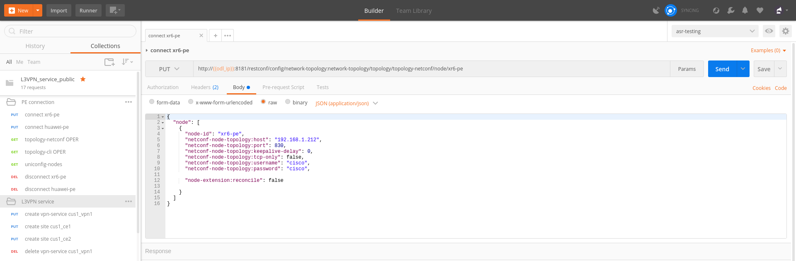
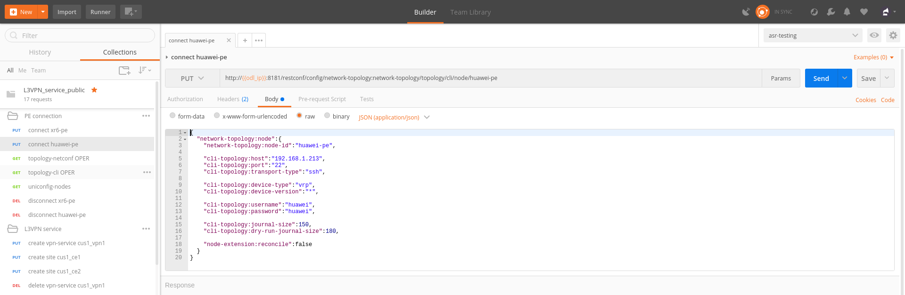
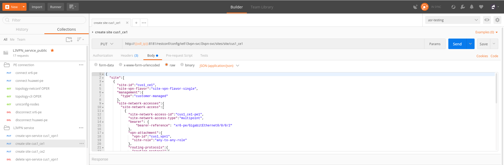
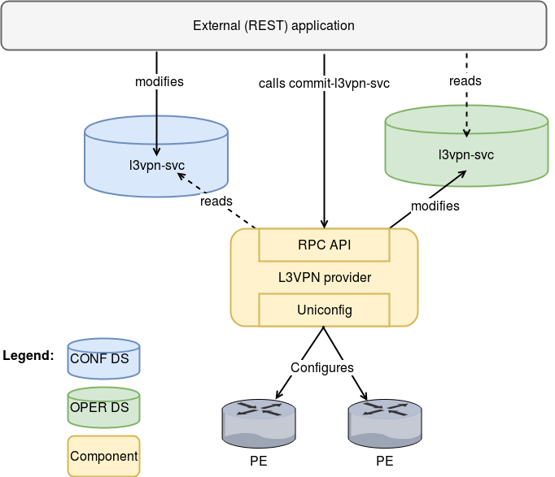

[Documentation main page](https://frinxio.github.io/Frinx-docs/)
[FRINX Features User Guide main page](https://frinxio.github.io/Frinx-docs/FRINX_ODL_Distribution/Carbon/user_guide.html)
# L3VPN Service Module User Guide
<!-- TOC -->

- [L3VPN Service Module User Guide](#l3vpn-service-module-user-guide)
    - [Usage - Setup](#usage---setup)
        - [FRINX ODL - Install features](#frinx-odl---install-features)
        - [Postman - Import collection](#postman---import-collection)
    - [Introduction](#introduction)
        - [Problem definition and L3VPN](#problem-definition-and-l3vpn)
        - [Terminology](#terminology)
        - [Topologies](#topologies)
            - [Any to Any](#any-to-any)
            - [Hub and Spoke](#hub-and-spoke)
    - [Usage - Operations Guide](#usage---operations-guide)
        - [Set up an L3VPN connection](#set-up-an-l3vpn-connection)
            - [1. Establish PE-routers connection](#1-establish-pe-routers-connection)
            - [2. Create VPN service](#2-create-vpn-service)
            - [3. Create sites](#3-create-sites)
        - [Delete the L3VPN connection](#delete-the-l3vpn-connection)
    - [L3VPN Provider](#l3vpn-provider)
        - [Use Case Specification](#use-case-specification)
        - [Architecture](#architecture)
            - [API description](#api-description)
        - [Network Element Plugin](#network-element-plugin)
            - [IOS-XRv Network Element Plugin](#ios-xrv-network-element-plugin)
            - [Mock Network Element Plugin](#mock-network-element-plugin)
        - [Known Limitations](#known-limitations)

<!-- /TOC -->

## Usage - Setup
### FRINX ODL - Install features
1. First, [start FRINX ODL](../../Operations_Manual/running-frinx-odl-after-activation.md). 
  - Wait for 3 minutes to ensure the start up process is complete.  
2. Then, in the karaf terminal which will have started, install the following features:  

```
feature:install frinx-l3vpn-app cli-southbound-all-units unified-topology-all-units
```
### Postman - Import collection
1. To download and use FRINX pre-configured Postman REST calls with L3VPN - see [this page](../../API.md). 
2. Follow that guide to import the file `postman_collection_L3VPN_service.json` from the directory `L3VPN Service Module`.
3. [Configure an environment in Postman](../../API.md) where you set a value for `odl_ip`.

Your system is now ready. To provision L3VPN see the [Usage - Operations Guide](#usage---operations-guide) below.

## Introduction
The goal of this project is to automate provisioning of Layer 3 Virtual Private Network (L3VPN) on Service Provider (SP) routers.

- This is done by using the FRINX ODL controller which configures routers based on intent of the L3VPN service. 
- The FRINX ODL controller translates the L3VPN service abstraction to network element configuration.  


### Problem definition and L3VPN
A company needs to reconnect multiple sites with each other via a Service Provider which provides L3 connectivity to the company. 
- The company's sites exchange routing information and multiple companies may use overlapping address space so there is a need to isolate companies and their address spaces. 
- L3VPN offers a solution for those requirements.

Host1 and Host2 are two different sites for the same company and they both connect to the Service Provider using a separate connection. They need to interconnect two of their sites.


In this case L3VPN provides site-to-site connectivity and the SP network behaves as a router between the company’s sites. The company’s routes are exchanged via the SP network.


### Terminology
The following terms are often used in the L3VPN domain:

 - **Customer Edge (CE)** device – router at customer site connected to SP
 - **Provider Edge (PE)** device – router at the edge of the SP network which provides connectivity for CE
 - **Provider (P)** device – core router on the SP network providing connectivity among PE routers


### Topologies
Common topologies used in L3VPN.

#### Any to Any
Sites can forward traffic directly among each other in a VPN. Communication is restricted to a particular VPN so it is not possible to communicate with sites on different VPNs. 


#### Hub and Spoke
Spoke sites in the VPN can communicate with each other only through the hub site. This is usually used when all sites must communicate through an access control device. 


## Usage - Operations Guide
To import the necessary Postman collection file see the section [Postman - Import collection](#postman---import-collection) at the top of this page.  

That file contains several REST calls for establishing a NETCONF connection and creating or deleting L3VPN instances, for which we provide guidance below:

### Set up an L3VPN connection
Three steps are required to create an l3vpn connection between two routers (we demonstrate this on Huawei NE5000E router connected to FRINX ODL via cli interface and on Cisco XR6 router connected via NETCONF). We will configure l3vpn service using Postman collection:  

#### 1. Establish PE-routers connection
This is between FRINX ODL and each of the two routers which we'll use for the L3VPN. 

- Use Postman REST calls: `PE-routers connection/connect xr6-pe` (for Cisco XR6 router) and `PE-routers connection/connect huawei-pe` (for Huawei NE5000E router):

- First edit the body of the call `PE-routers connection/connect xr6-pe` according to your setup for Cisco XR6 router:  
    
```json
{
  "node": [
    {
      "node-id": "xr6-pe",
      "netconf-node-topology:host": "192.168.1.212",//Edit according to your setup
      "netconf-node-topology:port": 830,
      "netconf-node-topology:keepalive-delay": 0,
      "netconf-node-topology:tcp-only": false,
      "netconf-node-topology:username": "cisco",//Edit according to your setup
      "netconf-node-topology:password": "cisco",//Edit according to your setup

      "node-extension:reconcile": false

    }
  ]
}
```


- Issue the call by hitting **Send**. You should receive the Response: Status **201 Created**

- Now configure the call `PE-routers connection/connect huawei-pe` in the similiar way, but this time editing the body according to your setup for Huawei NE5000E router:

```json
{
  "network-topology:node":{
    "network-topology:node-id":"huawei-pe",

    "cli-topology:host":"192.168.1.213",//Edit according to your setup
    "cli-topology:port":"22",
    "cli-topology:transport-type":"ssh",

    "cli-topology:device-type":"vrp",
    "cli-topology:device-version":"*",

    "cli-topology:username":"huawei",//Edit according to your setup
    "cli-topology:password":"huawei",//Edit according to your setup

    "cli-topology:journal-size":150,
    "cli-topology:dry-run-journal-size":180,

    "node-extension:reconcile":false
  }
}
```


- Again, issue the call by hitting **Send**, ensuring you receive the Response: Status **201 Created**

- It can take a few minutes before the connections are formed. We can check if they're ready by issuing the call `PE-routers connection/topology-netconf OPER` and `PE-routers connection/topology-cli OPER` respectively
  - You should receive the Response: Status **200 OK**
  - When you scroll through the Response body you should see a list **"available-capability"** for both PE-routers. If these are not listed, wait another minute and issue the call again.
- Both PE nodes should also appear in uniconig topology. We can check that by issuing the call `PE-routers connection/uniconfig-nodes`
  - You should receive the Response: Status **200 OK**
  - When you scroll through the Response body you should see both PE nodes in the **"node"** list. If they are not listed, wait another minute and issue the call again.

#### 2. Create VPN service 
This will be used in the next step when we create the L3VPN sites.  
- Use the Postman REST call: `L3VPN Service/create vpn-service cus1_vpn1`. You don't need to change any of the fields of the call body. You can change **customer-name** if you wish.

```json
{
  "vpn-service":[
    {
      "vpn-id":"cus1_vpn1",
      "customer-name":"customer1",
      "vpn-service-topology":"any-to-any",
      "l3vpn-param:vrf-name":"cus1_vpn1",
      "l3vpn-param:route-distinguisher":"300:60",
      "l3vpn-param:import-route-targets":{
        "route-target":"11:11"
      },
      "l3vpn-param:export-route-targets":{
        "route-target":"11:11"
      }
    }
  ]
}
```


- Issue the call by hitting **Send**. You should receive the Response: Status **201 Created**

#### 3. Create sites  
Use the Postman REST calls: `L3VPN Service/create site cus1_ce1` and `L3VPN Service/create site cus1_ce2`  
- First edit the body of the call `L3VPN Service/create site cus1_ce1` according to your setup. Only the fields with comments below should be edited:
```json
{
  "site":[
    {
      "site-id":"cus1_ce1",
      "site-vpn-flavor":"site-vpn-flavor-single",
      "management":{
        "type":"customer-managed"
      },
      "site-network-accesses":{
        "site-network-access":[
          {
            "site-network-access-id":"cus1_ce2-pe2",
            "site-network-access-type":"multipoint",
            "bearer": {
                "bearer-reference": "xr6-pe/GigabitEthernet0/0/0/2"
            },
            "vpn-attachment":{
              "vpn-id":"cus1_vpn1",
              "site-role":"any-to-any-role"
            },
            "routing-protocols":{
              "routing-protocol":[
                {
                  "type":"bgp",
                  "bgp":{
                    "autonomous-system":65102,
                    "address-family":[
                      "ipv4"
                    ]
                  }
                }
              ]
            },
            "ip-connection":{
              "ipv4":{
                "address-allocation-type":"static-address",
                "addresses":{
                  "provider-address":"10.3.22.1",//Edit according to your setup
                  "customer-address":"10.3.22.20",//Edit according to your setup
                  "prefix-length":24
                }
              }
            },
            "l3vpn-param:pe-bgp-as":100,
            "l3vpn-param:pe-bgp-router-id":"1.2.3.4",
            "l3vpn-param:route-policy-in":"RPL_PASS_ALL",
            "l3vpn-param:route-policy-out":"RPL_PASS_ALL"
          }
        ]
      }
    }
  ]
}
```


- Issue the call by hitting **Send**. You should receive the Response: Status **201 Created**

- We now need to commit by RPC: Issue the call `L3VPN Service/RPC commit-l3vpn-svc`. In the Response body you should receive "status": "complete". This shows the setup has been competed successfully.

- Now configure the call `L3VPN Service/create site cus1_ce2` in the same way, but this time editing the body according to your setup for site 2 

- Again, issue the call by hitting **Send**, ensuring you receive the Response: Status **201 Created**

- Finally, we again need to commit by RPC: Issue the same RPC call `L3VPN Service/RPC commit-l3vpn-svc`. In the Response body you should receive "status": "complete". This shows the setup has been competed successfully.

### Delete the L3VPN connection
If you want to remove the L3VPN connection:
1. Delete the L3VPN service by:
  - using the Postman REST call: `L3VPN Service/delete vpn service cus1_vpn1`. There is no body to the call. 
2. Delete the sites by: 
  - using the Postman REST call `L3VPN Service/delete site cus1_ce1`. There is no body to the call. 
  - repeat this for the second site using the REST call`L3VPN Service/delete site cus1_ce2`.
  
3. Commit by RPC: Issue the Postman REST call: `L3VPN Service/RPC commit-l3vpn-svc`. There is no body to the call.  
  - In the Response body you should receive "status": "complete". This shows the deletion has been competed successfully.

## L3VPN Provider
L3VPN Provider is an implementation which automatically provisions L3VPN on PE routers based on intended L3VPN service. 
- It exposes a domain-specific API for L3VPN manipulation and declarative configuration “what vs how”.
- L3VPN Provider supports *network-wide transactions*, which are transactions on top of multiple devices. 
- *Rollback* of a network wide transaction means rollback of configuration on each device which was a part of the conifiguration. 
- The rollback of a network-wide transaction is done *automatically* if there is failed configuration on at least one device.

### Use Case Specification
L3VPN Provider can be used on a network where:
 - Any to Any L3VPN topology is needed
 - CE - PE connection belongs to only one VPN
 - CE runs BGP for route advertising to PE


L3VPN Provider sits on top of the uniconfig and thus unified topology layers. L3VPN provider works only with the devices that have translation units for following frinx-openconfig modules available:

<table>
  <thead
    <tr>
      <th>
        Name
      </th>
      <th>
        Revision
      </th>
    </tr>
  </thead>
  <tbody>
    <tr>
      <td>
        frinx-openconfig-interfaces
      </td>
      <td>
        2016-12-22
      </td>
    </tr>
    <tr>
      <td>
        frinx-openconfig-if-ip
      </td>
      <td>
        2016-12-22
      </td>
    </tr>
    <tr>
      <td>
        frinx-openconfig-network-instance
      </td>
      <td>
        2017-02-28
      </td>
    </tr>
    <tr>
      <td>
        frinx-openconfig-bgp
      </td>
      <td>
        2017-02-02
      </td>
    </tr>
    <tr>
      <td>
        frinx-openconfig-routing-policy
      </td>
      <td>
        2017-07-14
      </td>
    </tr>
  </tbody>
</table>

The avalaible translation units for a device are resolved by unified topology during device connection.

A list of potential PE nodes can be obtained from (replacing odl_ip with the IP of the system on which you're running FRINX ODL):
```
GET http://odl_ip:8181/restconf/config/network-topology:network-topology/topology/uniconfig/
```

You can see the if the particular node is suitable as PE router by calling (replacing odl_ip with the IP of the system on which you're running FRINX ODL and node_id with id of the particular PE node):
```
GET http://odl_ip:8181/restconf/operational/network-topology:network-topology/topology/unified/node_id
```
You should see the above mentioned modules in the node's **"capability"** list.

### Architecture
L3VPN Provider is composed of multiple components and takes andvantage of uniconfig framework. The high level architecture is shown in the picture below.



- L3VPN provider takes the same apporach as Uniconfig Node Manager, ***l3vpn-svc*** in CONF DS contains intended L3VPN service configuration and ***l3vpn-svc*** in OPER DS conatins actual L3VPN service caonfiguration.
- An external application modifies ***l3vpn-svc*** in CONF DS. L3VPN can be configured on nodes which are present in uniconfig topology and support necessary capabilites. 
- When all changes are done, the external application calls RPC *commit-l3vpn-svc*. 
- The RPC reads the intended state from CONF DS, schedules processing, calculates diff between intended and actual configuration.
- This diff is configured inside the network-wide transaction on the necessary PE routers by translating the diff into the openconfig data and pushed into the uniconfig layer.

- If configuration of routers is successful then OPERD DS ***l3vpn-svc*** is updated with intended state. 
- If configuration on one of the devices fails, the uniconfig layer will rollback configuration on each affected PE node.

#### API description
The API is described using YANG modules. An external application can consume the API via RESTCONF, NETCONF, or JAVA. 
- The L3VPN service module provides domain-specific abstraction where the abstraction describes attributes of VPNs and sites instead of configuration of network elements. 
- The FRINX ODL controller translates the abstraction to network element configuration.

[ietf-l3vpn-svc@2018-01-19.yang](ietf-l3vpn-svc@2018-01-19.yang) (Click link to download)

The original YANG is from [RFC 8299](https://tools.ietf.org/html/rfc8299). Supported statements are shown in [generated UML from the original YANG](ietf-l3vpn-svc_uml.png). This YANG module is modified in order to reuse its parts and is extended with L3VPN Provider elements.

The YANG module contains 3 root statements and one RPC:

 - **container l3vpn-svc** – represents intended state which is stored in CONF DS and actual state stored in OPER DS
 - **rpc commit-l3vpn-svc** – starts processing intent of L3VPN service.

[l3vpn-svc-aug@2018-04-04.yang](l3vpn-svc-aug@2018-04-04.png) (Click link to download)

Augments ietf-l3vpn-svc module with statements which are needed for configuration of L3VPN.

### Known Limitations
- Implementation of L3VPN provider does not support all statements in ietf-l3vpn-svc@2018-01-19.yang. Unsupported statements can be found in YANG deviations.
- L3VPN Provider does not support reconciliation, therefore only L3VPN created via L3VPN Provider are visible through the API.

Other limitations:

 - Only Any to Any topology is supported
 - CE - PE connection must belong to only one VPN
 - Only BGP can be used between CE and PE
 - Pre-configured MP-BGP between PE and BGP Route Reflector must exist
 - Pre-configured Route Policy must exist


| Feature Guide         |             |                                                                                                     |
|-----------------------|-------------|-----------------------------------------------------------------------------------------------------|
| Feature introduced in | FRINX 2.3.0 | VPN service module implementation with support for L3VPN and IOS XR (Version 6.1.2) NEP via NETCONF |

