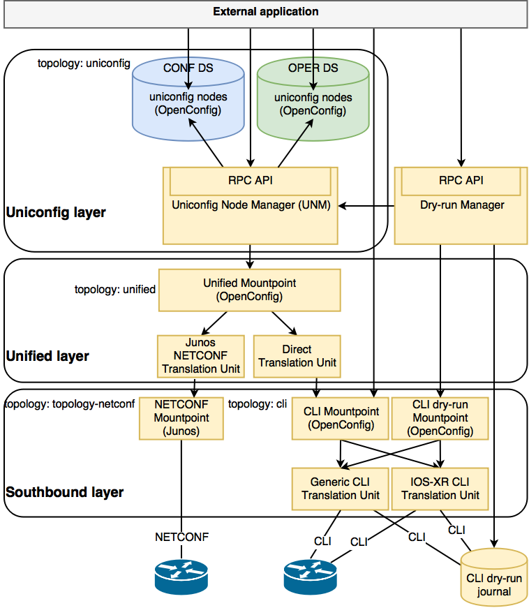

[Documentation main page](https://frinxio.github.io/Frinx-docs/)  
[FRINX Features User Guide main page](https://frinxio.github.io/Frinx-docs/FRINX_ODL_Distribution/Carbon/user_guide.html)  
<!-- TOC -->

- [UniConfig framework components](#uniconfig-framework-components)
    - [CLI Mountpoint](#cli-mountpoint)
        - [CLI Translation Units](#cli-translation-units)
    - [CLI dry-run Mountpoint](#cli-dry-run-mountpoint)
        - [CLI dry-run journal](#cli-dry-run-journal)
    - [NETCONF Mountpoint](#netconf-mountpoint)
    - [Unified Mountpoint](#unified-mountpoint)
        - [Direct Translation Unit](#direct-translation-unit)
        - [NETCONF Translation Unit](#netconf-translation-unit)
    - [Uniconfig Node Manager (UNM)](#uniconfig-node-manager-unm)
    - [Snapshot Manager](#snapshot-manager)
    - [Dry-run Manager](#dry-run-manager)
- [Components interactions](#components-interactions)
    - [NETCONF device configuration](#netconf-device-configuration)
    - [CLI device configuration](#cli-device-configuration)
- [Topologies](#topologies)
    - [CLI](#cli)
    - [NETCONF](#netconf)
    - [Unified](#unified)
    - [Uniconfig](#uniconfig)
- [Deployment](#deployment)
    - [Single node](#single-node)
    - [Clustering](#clustering)

<!-- /TOC -->
# UniConfig framework components

The figure below shows the high level architecture of the UniConfig framework, its
components and their dependencies.

UniConfig components use a layered design where the functionality of the upper layers
depends on the functionality of the layer underneath. Each layer thus provides
a higher level of abstraction from the network elements.

Applications are allowed to utilize any of the layers in the system.

There are 3 main layers represented by these components (from top to bottom):

- Uniconfig layer (Uniconfig Node Manager with datastore)
- Unified layer (Unified mountpoint with translation units)
- Southbound layer (NETCONF mountpoint, CLI mountpoint with
translation units)

The datastore is a component in ODL which stores structured data described by
YANG models. There are two separate datastores:

- Config datastore (CONF DS) - contains intended state (intended device
configuration). This datastore is persistent and external (outside ODL)
applications have read/write access.
- Operational datastore (OPER DS) - contains actual state (actual device
configuration). OPER DS is not persistent and external applications have
read only access.

Mountpoints in ODL represent a communication interface with an external system.
Mountpoints are usually registered under a node in a topology.

Components are described from bottom to top.

## CLI Mountpoint
The CLI mountpoint provides a management API for a network device over the CLI.
OpenConfig models are used for structured data describing the device
configuration and state.

The CLI mounpoint uses CLI translation units for translation between OpenConfig
data and CLI data.

The CLI mountpoint API supports device transactions and automatic
rollback functionality (in case an error occurs during device configuration
in device transaction). CLI mountpoint is registered under a node in cli
topology.

Each CLI mountpoint always includes a generic CLI translation unit which provides
an RPC for sending raw CLI commands and returning raw CLI output.

### CLI Translation Units
A CLI translation unit defines a mapping between YANG models and the CLI.

It is used by the FRINX ODL controller to perform translation between
device specific CLI data and standardized structured (OpenConfig YANG) data.

The translation unit can read and write configuration or read the state of a device.
It uses the CLI over SSH or telnet for communication with the CLI device.

Junos and IOS-XR translation units are just simplified examples.
The CLI translation unit is usually created for a combination of device type
and OpenConfig main section (folder) e.g. xr-6-network-instance,
xr-6-ospf, ios-local-routing, ios-ospf, etc.

## CLI dry-run Mountpoint
The CLI dry-run mountpoint mocks the management API for a network device over CLI.
It uses the CLI dry-run journal for storing to-be-executed CLI commands instead
of configuring the network device directly. Just as with a regular CLI mountpoint,
it uses the same set of CLI translation units and the same set of OpenConfig
YANG models.

### CLI dry-run journal
The CLI dry-run journal is used for storing to-be-executed commands from the CLI
dry-run mountpoint. The journal is cleared and read by Dry-run Manager.

## NETCONF Mountpoint
The NETCONF mountpoint provides a management API for the network device over a NETCONF session.
Data are usually described by a set of vendor specific YANG models.The NETCONF
mountpoint provides device transactions (if supported by the device).
Automatic rollback may also be supported.
The NETCONF mountpoint is registered under a node in topology-netconf topology.

## Unified Mountpoint
The Unified mountpoint unifies the API for various southbound protocols like NETCONF
and CLI. The API is described using OpenConfig YANG models and uses
translation units to translate between OpenConfig data and southbound
mountpoint data. Unified mountpoint is registered under a node in unified
topology.

### Direct Translation Unit
This translation unit does not translate data from one format to another
because northbound data and southbound data are described by the same
OpenConfig YANG. It can simply pass OpenConfig data to any mountpoint with
OpenConfig available-capabilities.

### NETCONF Translation Unit
The NETCONF translation unit translates OpenConfig data to data described by
device specific YANG models. It uses the NETCONF mountpoint for communication
with a NETCONF device, and also implements device transaction
with automatic rollback if it is not provided by the device.

The Junos NETCONF translation unit is a simplified example. The NETCONF translation unit is
usually created for a combination of device type and OpenConfig main
section (folder). An example is xr-6-network-instance, xr-6-ospf,
ios-local-routing, ios-ospf, etc.

## Uniconfig Node Manager (UNM)
The responsibility of this component is to maintain configuration on devices
based on intended configuration. Each device and its configuration is
represented as a node in the uniconfig topology and the configuration of this node
is described by using OpenConfig YANG models. The Northbound API of UNM is
RPC driven and provides functionality for commit with automatic rollback
and synchronization of configuration from the network.

When a commit is called, the UNM creates a diff based on intended state from
CONFIG DS and actual state from OPER DS. This Diff is used as the basis for device configuration.
UNM prepares a network wide transaction which uses Unified mountpoints for communication with different types of devices.

In the case where the configuration of one device fails, the UNM executes automatic rollback
where the previous configuration is restored on all modified devices.

Synchronization from the network reads configuration from devices and stores
it as an actual state to the OPER DS.

## Snapshot Manager
The snapshot manager creates and deletes uniconfig snapshots of
actual uniconfig topology. Multiple snapshots can be created
in the system.

Snapshots may be used for manual rollback. Manual rollback enables simple
reconfiguration of the entire network using one of the previous states
saved in snapshots. That means that uniconfig nodes in config datastore
are replaced with uniconfig snapshot nodes.

## Dry-run Manager
The dry-run manager provides functionality for mock configuration of CLI devices where CLI
commands are sent to the CLI dry-run journal instead of the device.

The dry-run manager uses Uniconfig Node Manager for getting the diff of the intended configuration and uses the CLI dry-run mounpoint for sending CLI commands to the dry-run journal.

# Components interactions
The figures below show the interactions in UniConfig triggered by an external application.

## NETCONF device configuration
UniConfig uses NETCONF for device configuration. An external application can also use the CLI RPC from the Generic CLI translation unit for direct communication.

The device is firstly mounted as a node to *topology-netconf* and then to topology *cli*.

## CLI device configuration
UniConfig uses CLI for device configuration. An external application can also use the CLI RPC for direct communication and CLI dry-run. The device is mounted as a node in topology *cli*.

# Topologies
The UniConfig framework uses various topologies on different layers.
Each topology contains nodes in the CONF and OPER datastores.

## CLI
The cli topology contains nodes which are connected with ODL via the CLI.

A node in CONF DS contains information on how the FRINX ODL controller should connect
to CLI devices (i.e. IP address, port, username, password, etc.) and a node in OPER DS contains the state of connection with available-capabilities.

CLI mountpoints are registered under these nodes. Configuration and state on the device can be obtained from the mountpoint.

## NETCONF
The topology-netconf topology contains nodes which are connected with FRINX ODL through
NETCONF. A node in CONF DS contains information on how the FRINX ODL controller should connect
to NETCONF devices (i.e. IP address, port, username, password, etc.) and a node in OPER DS contains the state of connection with available-capabilities.

NETCONF mountpoints are registered under these nodes. Configuration and state on the device can be obtained from a mountpoint.

## Unified
A node in unified topology only contains data about connection state and available-capabilities in OPER DS. Unified mountpoints are registered under these nodes.

## Uniconfig
Nodes in the uniconfig topology contain the entire configuration of devices.
A node in CONF DS describes the intended configuration and the same node in OPER DS shows the actual device configuration.

# Deployment
The UniConfig framework can be deployed on a single node (PC, laptop, VM, docker container) or on multiple nodes (servers, VMs, docker containers) as a cluster.

## Single node
In the most simple deployment case, all applications run on a single node. This deployment is usually used during the development phase or PoC and might be used when the application functionality and behaviour is being tested. After the node is restarted, only the CONFIG DS is restored.

## Clustering
Clustered deployment usually use 3 nodes. This deployment provides high availability
(HA) because data is replicated on each node.

The UniConfig framework runs on all nodes but is only in active state on one and is in standby state on the other nodes. When an active node goes down or becomes unreachable to other
nodes, one of the standby nodes becomes active. This deployment can handle only
one node being lost. Once the lost node is running again it will automatically join
the cluster and synchronize itself. If all nodes are restarted only the CONFIG DS is restored.
