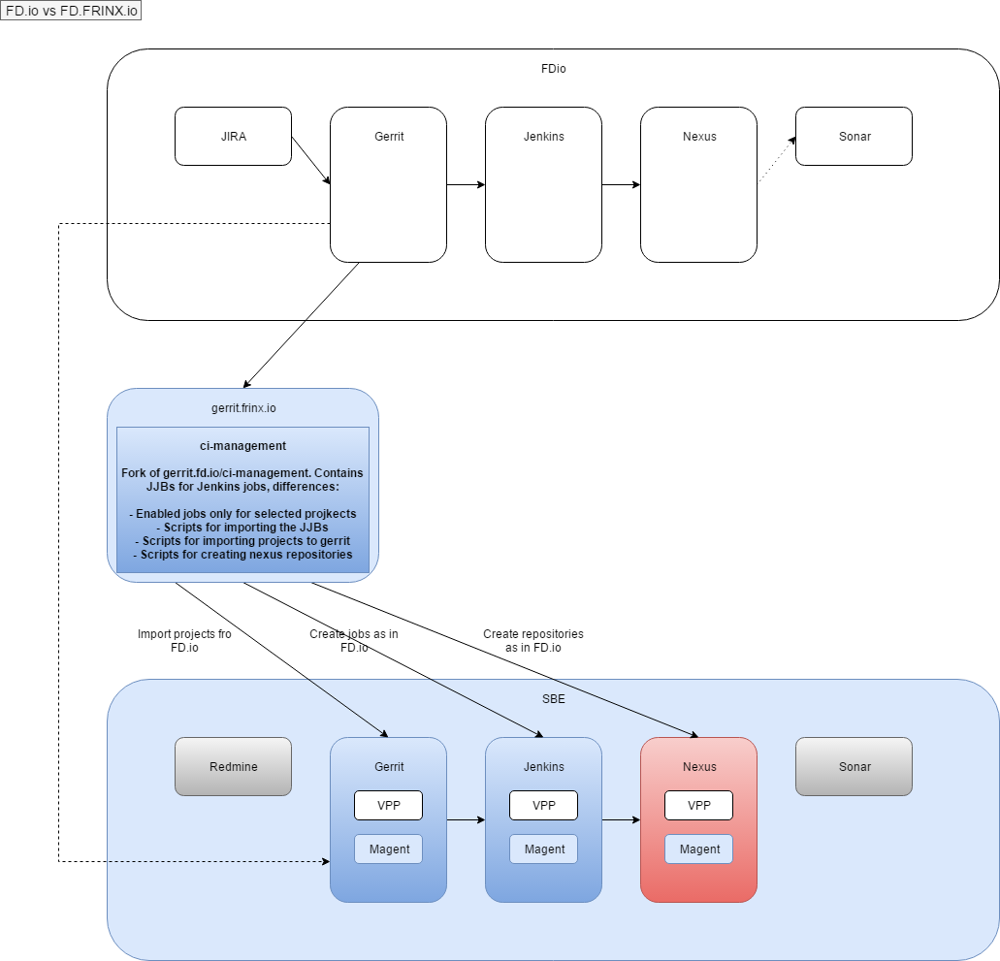
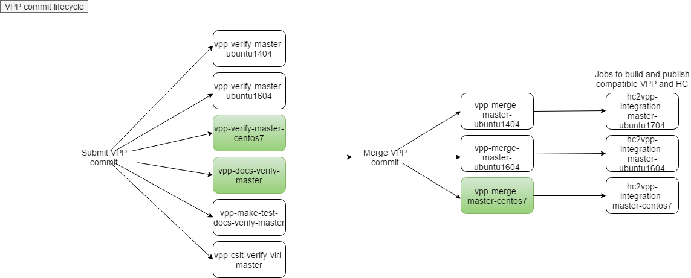

# FRINX VPP Distribution: Introduction

FRINX provides an FD.io distribution.  
FD.io is an opensource project that among other things provides the Vector Packet Processor. More information can be found at [FD.io][1].  
This page contains the details about the FRINX fd.io distribution.

### Features

**Project imported from open source:**

*       VPP 
    *   No changes

**Internal projects:**

*       VPP-monitoring-agent (magent)

### Operations

**CI/CD**

There is a custom CI/CD pipeline for the FRINX fd.io distribution. It is based on [SBE ][2].  
The following diagram shows the relationships between FD.io and FD.FRINX.io:

### Jenkins jobs

The following diagrams list the jenkins jobs imported from opensource FD.io (green marks imported):

 [1]: http://fd.io
 [2]: ../../FRINX_Smart_Build_Engine/Introduction/sbe_intro.md
